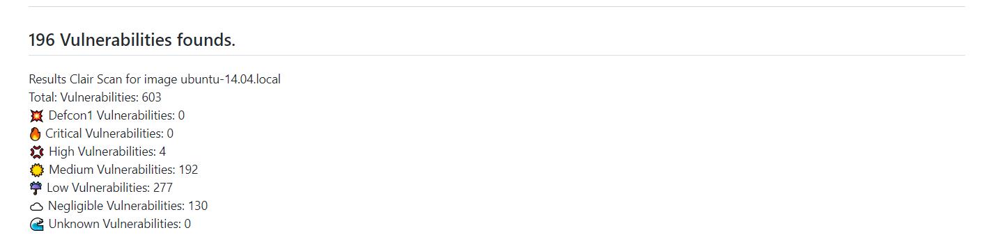
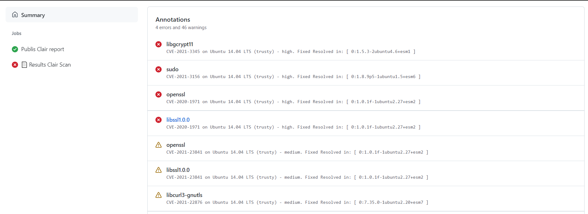
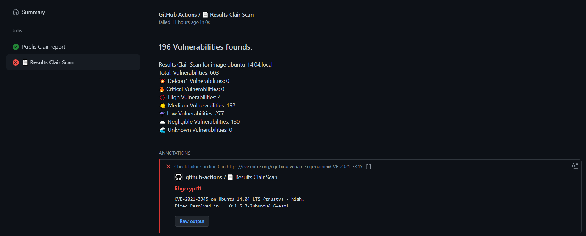
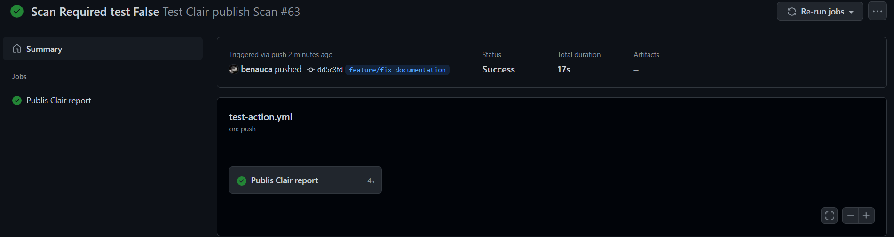
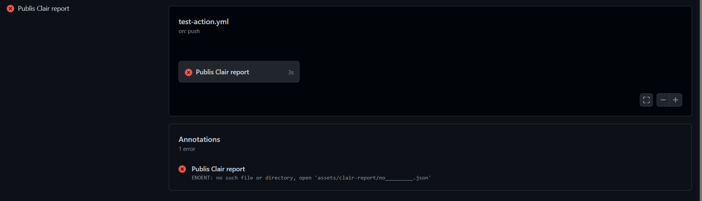
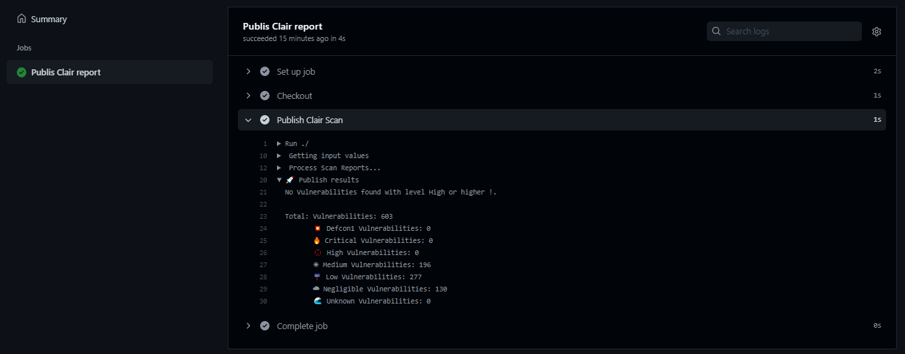
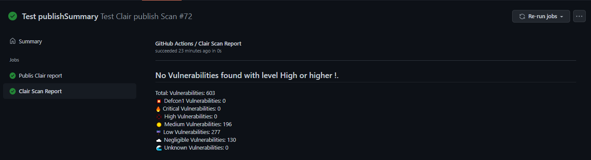

<h1 align="center"> Publish clair report  </h1> <br>

<p align="center">
    Publish the vulnerabilities founded in the clair reporting scanning  
</p>

# Table Of Contents

1. [Introduction](.#introduction)
2. [Setup](.#setup)
   1. [Workflow](.#workflow-configuration)
   2. [Inputs](.#inputs)
3. [Build](.#build)
4. [Test](.#test)
5. [Lint](.#lint)
6. [Examples](.#examples)

# Introduction

The main motivation of the action is to be able to publish the vulnerabilities
found during Clair's analysis in the workflow itself as a job part to have the
report available before uploading it to Harbor.





# Setup

## Workflow Configuration

```yaml
  name: publish
  on:
    pull_request:

    jobs:
      build:
        name: Build and Run Tests
        runs-on: ubuntu-latest
        steps:
          - name: Checkout Code
            uses: actions/checkout@v1
          - name: Launch Scan
            uses: santander-group/clair@v1
          - name: Publish Scan Report
            uses: santander-group/publish-clair-report@v1
            if: always() # always run even if the previous step fails
            with:
              report_paths: '**/clair-reports/*.json'
```

## Inputs

| **Input**                   | **Required**  | **Default**               | **Description**                                                                                           |
|:---------------             |:-----         |:--------                  |:---------------------------------------------------------------------------------------------------|
| `report_paths`              | **True**      | `no`                      | Clair report paths.                                                                                |
| `severity_level`            | **False**     | `High`                    | Clair Severity level for Filter `Unknown` `Negligible` `Low` `Medium` `High` `Critical` `Defcon1`  |
| `token`                     | **False**     | `${{ github.token }}`     | GitHub token for creating a check run.                                                             |
| `check_name`                | **False**     | `Scan Report`             | Check name to use when creating a check run.                                                       |
| `fail_with_vulnerabilities` | **False**     | `false`                    | By default always finish with status true.                                                        |
| `require_scans`             | **False**     | `false`                   | Fail if no report are found.                                                                       |
| `summary`                   | **False**     | `no`                      | Additional text to summary output                                                                  |
| `publish_summary`           | **False**     | `false`                   | Print the Summary if Not founds Vulnerabilities                                                    |

## Build

```bash
# Install the dependencies  
$ npm install

# Build the typescript and package it for distribution
$ npm run build && npm run package
```

## Test

```bash
# Run the tests, use to debug, and test it out
$ npm test
```

## Lint

```bash

# Verify lint is happy
$ npm run lint -- --fix
```

For the markdown file

```bash

npm install -g markdownlint-cli@0.25.0

markdownlint '**/*.md' -c .github/config/lint-config.yml
markdown-link-check '**/*.md' -c .github/config/mlc_config.json
```

# Links

- [Working With Github actions](https://jeffrafter.com/working-with-github-actions/)

# Examples

## Restrictions

- Only publish 50 annotations.
- Only parsers json file.

## By Default

By default, it always ends with status success even if it finds vulnerabilities
with criticality higher than High.

```yaml
- name: Publish Scan Report
  uses: santander-group/publish-clair-report@v1
  if: always() # always run even if the previous step fails
  with:
    report_paths: assets/clair-report/ubuntu*.json
```

Must publish the result in another job called `Clair Scan Report` with status
`success` even if there are vulnerabilities, look that Only gets high
vulberabilities.


## Finish with status Failed

By default, it always ends with status success even if it finds vulnerabilities
with criticality higher than High. If we want to indicate the failed state of
the analysis we must mark true the condition `fail_with_vulnerabilities`

```yaml
- name: Publish Scan Report
  uses: santander-group/publish-clair-report@v1
  if: always() # always run even if the previous step fails
  with:
    report_paths: assets/clair-report/ubuntu*.json
    fail_with_vulnerabilities: 'true'
    check_name: ' 📄  Results Clair Scan'
    summary: 'Results Clair Scan for image ubuntu-14.04.local'
    severity_level: 'Medium'
```



## Scan File is required and must be exited

By default the job isn't fail even there isn't scan file.

```yaml
  - name: Publish Clair Scan
    uses: santander-group/publish-clair-report@v1
    with:
      report_paths: assets/clair-report/notExists.json
```



If we want that finishes with errors

```yaml
  - name: Publish Clair Scan
    uses: santander-group/publish-clair-report@v1
    with:
      report_paths: assets/clair-report/notExists.json
      require_scans: true
```



## Publish Summary if not founds vulnerabilities with the severity level

By default, if we do not found vulnerabilities associated with the severity
level or higher, we don't publish the Summary. We only print it at
the console.



If we want publish on annotations

```yaml
  - name: Publish Clair Scan
    uses: santander-group/publish-clair-report@v1
    with:
      report_paths: assets/clair-report/without-securityLevel-vulnerabilities.json
      publish_summary: 'true'
      severity_level: 'High'
```


